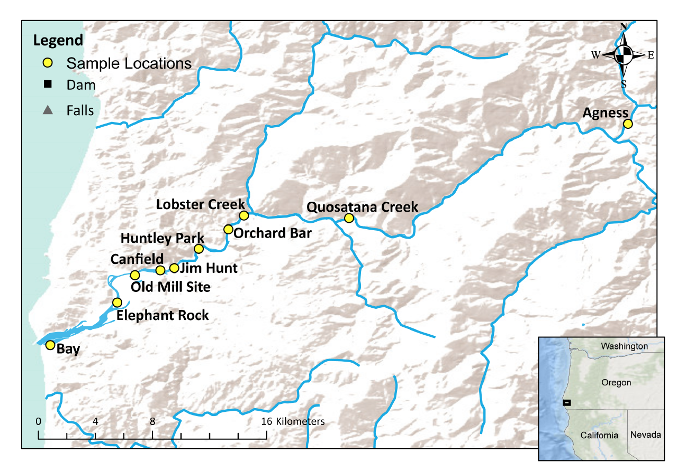
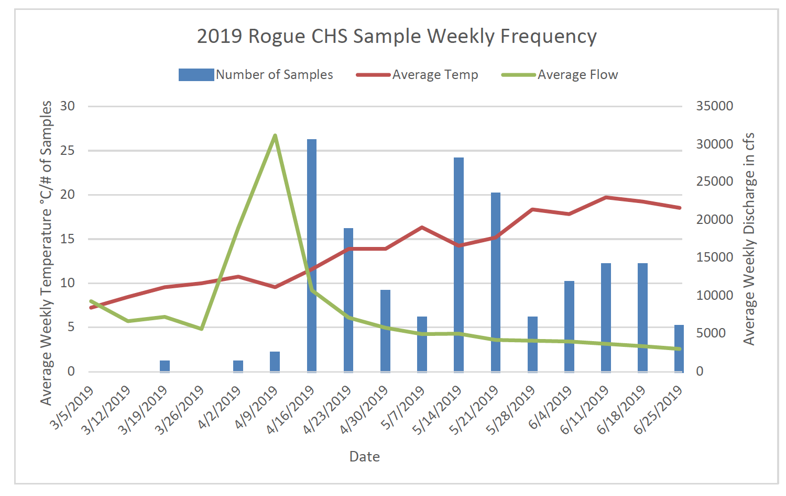

```{r, message=FALSE, warning=FALSE}

require(cowplot)
require(adegenet)
require(knitr)
require(tidyverse)
require(magrittr)
require(kableExtra)
require(gt)
require(gtsummary)

```

# Readme

This is document is an R notebook. If you'd like view to pre-rendered figures, read a summary of analysis and interact with code, please open the relevant html file in a browser. 

To conduct a similar analyses on your computer, edit or run code: clone this repository into a directory on your local machine and open the .Rproj file in Rstudio.

# Rationale

This is the analysis log for the 2020 Lower Rogue Chinook Project. 

SFGL produced a ODFW information report describing the the distribution of early- and late-migration associated alleles over time among Chinook Salmon sampled by anglers in the lower Rogue River form March to July, 2019.

The goals for this report are to update the results of the 2019 report with data from the 2020 run that have been sampled over a longer period of time: (1) characterize the transition from early- to late-migration associated alleles from Chinook salmon sampled in the lower Rogue in 2020, particularly at the primary SNP used in previous reports, (2) update any other results/figures from the previous report.

We'll also briefly characterize the genetic variation in the broader GREB1L/ROCK1 genomic region, including evidence of recombination between early and late haplotypes, reproduce any results from previous reports with the updated sampling.

# Data Summary

## Samples

```{r, message = FALSE, warning=FALSE}

metadata <- read_tsv("metadata/Intake_0004_OtsAC20ROGR_ProgenyEntry.txt")

#clean up the progeny info and make human-interpretable
metadata %<>%
  select(-c(FieldID2, ReleaseDate, ReleaseLocation, SpeciesID, SPECIES, Jar, Run, Gender, `MEPS Length (mm)`, LengthMEPS, `FORK LENGTH (mm)`, LengthFork1, ScaleNumber, Marks, PITTagNum, COMMENTSGeneral)) %>% #get rid of all blank columns
  rename(location = Launch, detailed_location = IndividualSampleLOCATION)
  
# keep cleaning up
metadata %<>%
  mutate(DateSampled = lubridate::mdy(DateSampled)) %>% #add julian day /week
  mutate(julian_day = lubridate::yday(DateSampled)) %>%
  mutate(julian_week = julian_day %/% 7) %>%
  mutate(CaptureMethod = tolower(CaptureMethod))
  
```

Fin clips or operculum punches were taken from 211 individual natural origin Chinook salmon sampled in the lower Rogue by the ODFW Huntley Park seining crew, creel surveys ("cleaning station") and volunteer anglers from April 5th to September 30th, 2020. Sample locations ranged from the Bay upstream to Quosatana Creek (see map). 

```{r, message=FALSE, warning=FALSE}
to_sum <- select(metadata, Location = location, Age, CaptureMethod) %>%
  mutate(Location = fct_relevel(Location, "Rogue Bay", "Port", "Mill Site", "Huntley Park", "Lobster Creek", "Quosatana"))

tbl_summary(to_sum, by = CaptureMethod) %>%
  modify_header(label ~ "") %>%
  modify_spanning_header(c("stat_1", "stat_2", "stat_3") ~ "**Sampling Method**") %>%
  as_kable_extra() %>%
  kable_classic(full_width = F, html_font = "Arial")# %>%
  #as_flex_table() %>%
  #flextable::save_as_docx(path = "report_draft/table1.docx")

#the date bins don't align across different datasets, let's set a break vector and use it for all plate
break.vec <- c(seq(from = as.Date("2020-02-26"), to = as.Date("2020-09-30"), by = "week"))

ggplot(data = metadata)+geom_histogram(aes(x = DateSampled, color = CaptureMethod, fill = CaptureMethod), breaks = break.vec)+theme_classic()+xlab("Week Sampled")+ylab("Number Sampled")+scale_x_date(date_labels = "%b %d", name = "Sampling Date", breaks = break.vec, limits = as.Date(c("2020-04-01", "2020-10-01"))) + theme(axis.text.x = element_text(angle=90)) + scale_color_viridis_d(name = "Sampling Method", labels = c("Volunteer Angler", "Creel Survey", "Seine"))+scale_fill_viridis_d(name = "Sampling Method", labels = c("Volunteer Angler", "Creel Survey", "Seine"))+scale_y_continuous(expand = c(0,0))

```


*note all "Port" samples from table above correspond to "Elephant Rock" in the map


## Genotypes

Samples were already genotyped as part of previous project and the corresponding genotyping notebook can be found [here](https://github.com/david-dayan/rogue_discordant/blob/main/genotype_notebook.html)

```{r, message=FALSE, warning=FALSE}
load(file = "genotype_data/genind_2.0.R")
load(file = "genotype_data/genotypes_2.2.R")

#filter by samples in the lower rogue (in the metadata)
genos_2.2 %<>%
  filter(sample %in% metadata$`Individual Name`) %>%
  select(-c(date, NOR_HOR, location, `Greb1L SNP1`, `Greb1L SNP2`, repeat_sample)) %>%
  left_join(metadata, by = c("sample" = "Individual Name"))

#genind
genind_2.0 <- genind_2.0[which(indNames(genind_2.0) %in% genos_2.2$sample),]


```

```{r, eval = FALSE}
marker_info <- read_csv("genotype_data/marker_info.csv")

marker_info %<>%
  mutate(a1_count =  as.numeric(substr(a1_count, 3, nchar(a1_count)))) %>%
  mutate(a2_count =  as.numeric(substr(a2_count, 3, nchar(a2_count)))) %>%
  mutate(ind = str_remove(ind, "^\\./")) %>%
  mutate(ind = str_remove(ind, "\\.genos")) %>%
  mutate(ind = str_sub(ind, 0, 16))


marker_info %>%
  filter(marker %in% colnames(genos_2.2)) %>%
  filter(ind %in% genos_2.2$sample) %>%
  mutate(sumdepth=a1_count+a2_count) %>%
  summarise(mean=mean(sumdepth, na.rm = TRUE), median=median(sumdepth, na.rm = TRUE), sd=sd(sumdepth, na.rm = TRUE))
```


__Filtering Summary__  
Of the 211 individuals genotyped at 353 GT-Seq markers, we retained 209 individuals and 330 markers. Median depth was 311, mean was 551 +- 784 (sd)

# Sampling Effort and Environmental Data

## ODFW Spreadsheet
Previous report presented some information about environmental conditions and  angling sampling effort. It is summarized in the following figure .

__data error__  
We received a spreadsheet with some of this data, but it spans only the period when angler samples were taken. It also conflicts with the other metadata received. The total number of angler caught samples recorded by week that was included in this spreadsheet is 74, whereas only 67 angler caught samples are in the metadata. I haven't been able to figure out this discrepancy with certainty, other than the possibilities that (a) some catches were recorded, but no corresponding sample was taken, or (b) a simple typo. 

The spreadsheet was also internally inconsistent, with monthly cumulative sample number equal to 67. Given this piece of information, I'm assuming the weekly running totals contain a typo, and I chose to use the information from the metadata and monthly running sums to construct the figure below.

_Update_  
Received an updated version of this file, but it still had some similar issues. We're confident the metadata for the samples we received are correct so we'll just get the environmental data ourselves and calculate our own running totals.

__Angler Sampling vs Temp and Discharge__

First let's create the figures exactly as they appear in the 2019 report.

```{r, message=FALSE, warning=FALSE}

env_data <- read_tsv("metadata/env_data.txt")

jw_cumsum2020 <- metadata %>%
  filter(CaptureMethod == "angler") %>%
  group_by(julian_week) %>%
  summarise(n_2020 = n())

env_data %<>%
  left_join(jw_cumsum2020, by = c("JW" = "julian_week")) %>%
  mutate(n_2020 = replace_na(n_2020, "0")) %>%
  mutate(n_2020 = as.numeric(n_2020)) %>%
  mutate(cumsum_2020 = cumsum(n_2020))

#first lets plot all together on one figure

#first fix the dataset (make it long instead of wide, all data is repeated within the variable julian_week and across two years: 2019 and 2020)
env_data_long <- pivot_longer(env_data, cols = !JW,  names_to = c(".value", "year"), names_sep = "_")

# now make the figure
#note that dual axis figures like this have MAJOR problems 
#the code below is so complicated because ggplot puts as many roadblocks as possible in front of the user to prevent them from making these figures

ggplot(data = env_data_long)+geom_line(aes(x = JW, y = temp, color = year))+geom_bar(aes(x = JW, y =n, fill = year), stat = "identity", position = "dodge", alpha = 0.7)+geom_line(aes(x = JW, y =discharge/1590.909, color = year), linetype = 6, size = 1.2)+
  scale_y_continuous("Temperature / sample count per week\nsolid line and bars", sec.axis = sec_axis(~ .*1590.909, name = "Discharge\ndashed line"))+scale_fill_manual(values = c("#CC3311", "#0077BB"))+scale_color_manual(values = c("#CC3311", "#0077BB"))+theme_classic()+xlab("Julian Week")

#we can also just plto 2020
ggplot(data = filter(env_data_long, year == 2020))+geom_line(aes(x = JW, y = temp, ))+geom_bar(aes(x = JW, y =n), stat = "identity", position = "dodge", alpha = 0.7)+geom_line(aes(x = JW, y =discharge/194), linetype = 6, size = 1.2)+
  scale_y_continuous("Temperature / sample count per week\nsolid line and bars", sec.axis = sec_axis(~ .*194, name = "Discharge\ndashed line"))+theme_classic()+ggtitle("2020")+xlab("Julian Week")

```

There are major issues with two (or in this case 3 with 2 redundant) y-axis figures like this. The biggest though is just that it is difficult to orient yourself to the data. I provide an alternative below, with faceted figures. 
```{r}

#let's make the longest possible dataset, with all values set to a simple variable named value and all variable captured in a variable named variable
env_double_long <- pivot_longer(env_data_long, cols = c(discharge, temp, n, cumsum), names_to = "variable", values_to = "value")%>%
  filter(variable != "cumsum")

#from the excel formulas in the spreadsheet "2020 spring chinook genetics" I inferred 2/26/2020 is the first day of julian week 9 in the environmental data. let's add a date column using this start date 
env_double_long %<>%
  mutate(date = lubridate::mdy("2/26/2021")+lubridate::days((JW-9)*7))

env_double_long %<>%
  mutate(value = na_if(value, 0))

g1 = ggplot(env_double_long, aes(date, value, color = year, fill = year))+facet_wrap(~variable, nrow = 3, scales = "free_y", strip.position = "left", 
                labeller = as_labeller(c(discharge = "Discharge (cfs)", n = "Number of\nindividuals sampled", temp = "Temperature (°C)") ))

g2 = g1 + geom_bar(data = filter(env_double_long, variable == "n"),
                    stat = "identity", position = "dodge")
g3 = g2 + geom_line(data = filter(env_double_long, variable %in% c("discharge", "temp") )) 
g3 + theme_bw()+theme(strip.background = element_blank(), strip.placement = "outside")+ylab(NULL)+scale_fill_manual(name = "Year", values = c("#CC3311", "#0077BB")) +scale_color_manual(name = "Year", values = c("#CC3311", "#0077BB"))+xlab("Date")+scale_x_date(date_breaks = "1 week", date_labels = "%b %d", name = "Sampling Date")+ theme(axis.text.x = element_text(angle=90))
```

Caption for this figure: _Discharge (cfs) and river temperature (°C) at USGS Agness gauge (number 14372300), and number of spring Chinook salmon sampled by anglers per week in 2019 (previous information report) and 2020. Values are averaged or summed over 7 day bins_

The same figure but only using 2020 data is below:

```{r, message = FALSE, warning = FALSE}

#let's make the longest possible dataset, with all values set to a simple variable named value and all variable captured in a variable named variable
envl2 <- filter(env_double_long, year == 2020, JW >= 13, JW <=24 )
g1 = ggplot(envl2, aes(date, value))+facet_wrap(~variable, nrow = 3, scales = "free_y", strip.position = "left", 
                labeller = as_labeller(c(discharge = "Discharge (cfs)", n = "Number of\nindividuals sampled", temp = "Temperature (C)") ))
g2 = g1 + geom_bar(data = filter(envl2, variable == "n", year == 2020),
                    stat = "identity")
g3 = g2 + geom_line(data = filter(envl2, variable %in% c("discharge", "temp") , year == 2020)) 
g3 + theme_bw()+theme(strip.background = element_blank(), strip.placement = "outside")+ylab(NULL)+xlab("Date")+scale_x_date(date_breaks = "1 week", date_labels = "%b %d", name = "Sampling Date")+ theme(axis.text.x = element_text(angle=90))


```

Note that these figures also have an issue in that the bin sizes are different in some weeks across years due to the leap year. Rather than publish this slightly misleading figure we'll fix it by using julian day (below: section USGS Data)


__Effort Over Time__

Previous report describes a pattern of shifting fishing effort upstream with the season, do our samples capture this pattern?

```{r}
ggplot(data = filter(metadata, CaptureMethod == "angler"))+geom_density(aes(x = DateSampled, color = location, fill = location), alpha = 0.5)+theme_classic()+xlab("Date")+ylab("Number Sampled") 
```

No, we didn't mangage to capture the fleet moving upstream to follow the fish with our data. Personal communication from Andrew Wells (Chetco Broodstock BSA) suggests this is because of high upstream temps this year.

## USGS Data

The data provided by odfw was binned into julian weeks, but julian week boundaries differed across years because 2020 is a leap year, therefore there is no way combine data across years AND plot with actual dates instead of "julian weeks."

We need to get the sample data from 2019, and the USGS Agness Station daily discharge and temperatures for the relevant periods from 2019 and 2020.

__2019 dates__  
The full dataset for the 2019 report is included as an addendum. Simply copied into a text editor and did some regex to produce a table of sample dates.  

```{r, message=FALSE, warning=FALSE}
d_2019 <- read_tsv("metadata/2019_dates.txt")
d_2019 %<>%
  mutate(date = lubridate::mdy(date))
```


__Temperature and Discharge__  
Checked a few dates on the odfw spreadsheet to confirm I was pulling the right data, then got discharge and temp data from the USGS Agness monitoring station (number 14372300)

```{r, message=FALSE, warning=FALSE}
#the usgs provides data in 5 min intervals, let's modify it to the same format used before, average by day, then plot by week.

agn <- read_tsv("metadata/agness_2019_2020.txt")

#clean up
agn %<>%
  select(datetime, temp=`117615_00010`, discharge = `117616_00060` ) %>%
  mutate(date = lubridate::as_date(datetime)) %>%
  group_by(date) %>%
  summarise(temp = mean(temp, na.rm = TRUE), discharge = mean(discharge, na.rm = TRUE))


```


__Combine and make plot__  
Now that we have all of our data, let's combine and make a plot.
```{r, message=FALSE, warning=FALSE}
#create a daily count of fish sampled
day_counts <- bind_rows(d_2019, select(metadata, sample = `Individual Name`, date =DateSampled)) %>%
  count(date)

days<- bind_rows(d_2019, select(metadata, sample = `Individual Name`, date =DateSampled)) %>%
  mutate(yday = lubridate::yday(date),
         year = factor(lubridate::year(date)))
#create a combined dataset
agn %<>%
  left_join(day_counts)

#make it long
agn_long <- agn %>%
  pivot_longer(cols = !date, names_to = "variable") %>%
  mutate(yday = lubridate::yday(date),
         year = factor(lubridate::year(date)))


g1 = ggplot(filter(agn_long, variable == "discharge"))+geom_line(aes(yday, log10(value), color = year), size = 1.2, alpha = 0.9)+xlim(78, 280)+scale_color_viridis_d()+theme_bw(base_size = 8)+ylab("Log10(Discharge)\n(cfs)")+xlab(NULL)+theme(axis.text.x = element_blank() , plot.margin = unit(c(0, 0, 0, 0), "cm"))

g2 = ggplot(days)+geom_histogram(aes(yday, color = year, fill = year), position = position_dodge2(padding = 0.2), binwidth = 7)+xlim(78, 280)+scale_color_viridis_d(name = "Year")+scale_fill_viridis_d(name = "Year")+theme_bw(base_size = 8)+ylab("Number of\nindividuals sampled")+xlab(NULL)+scale_y_continuous(expand = c(0,0))+theme(legend.text = element_text(size = 10), legend.title = element_text(size = 10), axis.text.x = element_blank())

g3 = ggplot(filter(agn_long, variable == "temp"))+geom_line(aes(yday, value, color = year), size = 1.2, alpha = 0.9)+xlim(78, 280)+scale_color_viridis_d()+theme_bw(base_size = 8)+ylab("Temperature\n(°C)")+xlab("Julian Day")

plot_grid(
  plot_grid(
    g1 + theme(legend.position = "none")
    , g2 + theme(legend.position = "none")
    , g3 + theme(legend.position = "none")
    , ncol = 1
    , align = "hv")
  , plot_grid(
    ggplot()+theme_minimal()
    , get_legend(g2)
    , ggplot()+theme_minimal()
    , ncol =1)
  , rel_widths = c(4,1)
  )
```


# GREB1L-SNP1 and SNP2

The previous report focuses on two SNPs (Greb1L SNP1 (snp640165) and SNP2 (snp670329)). "Greb1L SNP1 is reportedly more diagnostic of adult migration phenotype than Greb1L SNP2 in Rogue River and Klamath River Chinook salmon populations." We tag the same SNPs at two markers in the Ots353 panels:  

__Greb1L SNP1 (snp640165):__ Ots37124_12277401 (RA4.T−12277551) SNP position: 12277551  
__Greb1L SNP2 (snp670329)):__ Ots37124_12310649	(RA7.T−12310799) SNP position: 12310799  	
```{r, message=FALSE, warning=FALSE}
t_snp_data <- genos_2.2 %>%
  select(one_of(colnames(metadata)), `Ots37124-12277401`, `Ots37124-12310649`)

# convert to SNP1 and SNP2 geno classes by phenotype association
# snp1 (Ots37124-12277401) early allele (empirically): T
# snp1 (Ots37124-12277401) late allele (empirically): A
# snp2 (Ots37124-12310649) early allele (empirically): A
# snp2 (Ots37124-12310649) early allele (empirically): T

t_snp_data %<>%
  mutate(SNP1 = case_when(`Ots37124-12277401` == "TT" ~ "early_homozygote",
                          `Ots37124-12277401` == "TA" ~ "heterozygote",
                          `Ots37124-12277401` == "AA" ~ "late_homozygote",)) %>%
  mutate(SNP2 = case_when(`Ots37124-12310649` == "AA" ~ "early_homozygote",
                          `Ots37124-12310649` == "AT" ~ "heterozygote",
                          `Ots37124-12310649` == "TT" ~ "late_homozygote",)) %>%
  mutate(geno_class_2snp = case_when(SNP1 == SNP2 ~ SNP1,
                                     SNP1 != SNP2 ~ "discordant"))
```

## Genotype Counts

Let's count the genotypes at SNP1 and SNP2
```{r}
kable(t_snp_data %>%
        ungroup() %>%
        dplyr::rename(Genotype = geno_class_2snp) %>%
        count(Genotype), caption = "Genotypes at BOTH SNPs") %>%
  kable_classic( full_width = F, position = "left", html_font = "Arial")

kable(t_snp_data %>%
        ungroup() %>%
        count(SNP1), caption = "Genotypes at SNP1") %>%
  kable_classic( full_width = F, position = "left", html_font = "Arial")


kable(t_snp_data %>%
        ungroup() %>%
        count(SNP2), caption = "Genotypes at SNP2") %>%
  kable_classic( full_width = F, position = "left", html_font = "Arial")
```


## Figure 3
First, let's reproduce figure 3 from the previous report exactly as it appears. This figure considers the status at both SNP1 and SNP2 for each day with a stacked bar chart, discordant samples are those where SNP1 and SNP2 do not agree (e.g. SNP1 is homozygous for the early allele, while SNP2 is heterozygous)

```{r}
# let's define our genotype color palette
# we use the "scientific" color palette "hawaii" from the Crameri et al nature paper, because it contains an (almost) green-yellow-orange transition in part of its range. 
# i got the color by choosing 3 equidistant colors with scico(n = 50, begin = 0.77, end = 0.23, palette = "hawaii")
# here are the colors: "#6FD185" , "#9D8C1B", "#964841"


ggplot(data = t_snp_data)+geom_bar(aes((DateSampled), fill = geno_class_2snp), width = 1)+theme_classic()+scale_fill_manual(values = c("#BBBBBB","#6FD185" , "#9D8C1B", "#964841"), name = "Genotype at SNP1\nand SNP2")+ theme(axis.text.x = element_text(angle = 90, vjust = 0.5, hjust=1))+scale_x_date(date_labels = "%b %d",breaks = break.vec, limits = as.Date(c("2020-04-01", "2020-09-31")))+xlab("Date")


```

This doesn't look quite as nice now that there are many more dates. Let's bin the data into julian weeks to make it more legible.

```{r}


ggplot(data = t_snp_data)+geom_histogram(aes(x = DateSampled,  fill = geno_class_2snp), breaks = break.vec)+theme_classic()+xlab("Date")+ylab("Number Sampled")+scale_x_date(date_labels = "%b %d", name = "Sampling Date", breaks = break.vec, limits = as.Date(c("2020-04-01", "2020-10-01"))) + theme(axis.text.x = element_text(angle=90))+scale_fill_manual(values = c("#BBBBBB","#6FD185" ,"#9D8C1B", "#964841"), name = "SNP1 and SNP2\nGenotypes", labels = c("Discordant", "Homozygous Spring", "Heterozygous", "Homozygous Fall"))+scale_y_continuous(expand = c(0,0))


#old plot
#ggplot(data = t_snp_data)+geom_bar(aes((jw_date), fill = geno_class_2snp), width = 7)+theme_classic()+scale_fill_manual(values = c("#BBBBBB", "#CC3311", "#009988", "#0077BB"), name = "SNP1 and SNP2\nGenotypes", labels = c("Discordant", "Early Homozygote", "Heterozygote", "Late Homozygote"))+ theme(axis.text.x = element_text(angle = 90, vjust = 0.5, hjust=1))+xlab("Julian Week")+scale_x_date(date_breaks = "1 week", date_labels = "%b %d", name = "Sampling Date")+scale_y_continuous(expand = c(0,0))#+scale_x_continuous(breaks = seq(13,39, by=2))

```

"number of samples with discordant, homozygous spring, heterozygous, and homozygous fall genotypes at greb1l SNP1 and SNP2 binned into week long periods bounded by the dates on the x-axis"

## SNP-1
Since we may be more interested in the first SNP (Ots37124-12277401), let's  make similar plots as above, but just for this SNP. This has the added benefit of reducing complexity caused by "discordant" individuals with recombined early/late haplotypes.

```{r}


ggplot(data = t_snp_data)+geom_bar(aes((DateSampled), fill = SNP1), width = 1)+theme_classic()+scale_fill_manual(values = c("#6FD185" , "#9D8C1B", "#964841"), name = "Genotype at SNP1")+ theme(axis.text.x = element_text(angle = 90, vjust = 0.5, hjust=1))+scale_x_date(date_labels = "%b %d",breaks = break.vec, limits = as.Date(c("2020-04-01", "2020-09-31")))+xlab("Date")


ggplot(data = t_snp_data)+geom_histogram(aes(x = DateSampled,  fill = SNP1), breaks = break.vec)+theme_classic()+xlab("Date")+ylab("Number Sampled")+scale_x_date(date_labels = "%b %d", name = "Sampling Date", breaks = break.vec, limits = as.Date(c("2020-04-01", "2020-10-01"))) + theme(axis.text.x = element_text(angle=90))+scale_fill_manual(values = c("#6FD185" ,"#9D8C1B", "#964841"), name = "Genotype at SNP1", labels = c( "Homozygous Spring", "Heterozygous", "Homozygous Fall"))+scale_y_continuous(expand = c(0,0))

```

Personally, I think it's hard to interpret these figures into clear boundaries for a transition from early to late alleles. A better visualization of the relavant information from a management perspective might be the cumulative proportion of all early-alleles observed to date. This figure is presented below.

```{r}
t_snp_data %<>% 
  ungroup() %>%
  arrange(julian_day) %>%
  mutate(SNP1_alleles = case_when(SNP1 == "early_homozygote" ~ 2,
                                  SNP1 == "heterozygote" ~ 1,
                                  SNP1 == "late_homozygote" ~ 0)) %>%
  mutate(cumulative_early_allele = cumsum(SNP1_alleles)) %>%
  mutate(portion_early = cumulative_early_allele/max(cumulative_early_allele))

ggplot(data = t_snp_data)+geom_line(aes(DateSampled, portion_early), size = 2, color = "#CC3311")+theme_classic()+geom_hline(aes(yintercept = 0.8), linetype = "dotted")+geom_vline(aes(xintercept = as.Date("2020-06-17")), linetype = "dotted")+geom_hline(aes(yintercept = 0.5), linetype = "dotted")+geom_vline(aes(xintercept = as.Date("2020-05-21")), linetype = "dotted")+scale_y_continuous(breaks = c(0, 0.25, 0.5, 0.75, 0.8, 1))+scale_x_date(breaks = c(as.Date("2020-04-01"), as.Date("2020-05-01"),as.Date("2020-05-21"), as.Date("2020-06-01"), as.Date("2020-06-17"), as.Date("2020-07-01"),as.Date("2020-08-01"), as.Date("2020-09-01"), as.Date("2020-10-01")), date_labels = "%b %d")+xlab("Julian Day")+ylab("Cumulative Proportion\nObserved Early Alleles")+theme(axis.text.x = element_text(angle=90))


```

This metric introduces a different problem though, it is sensitive to sampling effort. For example, if little effort to sample individuals was spent early in the season relative to late, then the date at which the cumulative proportion of observed alleles crosses an arbitrary theshold will be pushed back in time, relative the true value in nature. 

Of course, the previously used metrics (first and last dates that particular genotypes are observed) are also sensitive to sampling effort (increased sampling effort will lead to earlier earliest dates and later latest dates, and uneven effort will bias one more than the other), so it might be useful to include both and just note the issue in the discussion. We could get fancy here and try to normalize the data, but this seems well beyond the scope of this report.


## SNP1 and SNP2 Result Summary

As expected the proportion of fish with early migration associated alleles decreases over time. We can describe the time of this transition in several ways based on SNP1:  

_First Late (Fall) Allele_  
The earliest observed late-migration allele occurs in a discordant individual in week 18 (May 5th). This individual was heterozygous at SNP1.  

_Last Early (Spring) Allele_  
Week 35 (September 4th) was latest time that an individual bearing an early-migration allele at SNP1 was observed.

_Last Early (Spring) Homozygote_  
Week 28 (July 19th) was latest time that a homozygous early early-migration allele was observed.

_Cumulative Proportion_  
50% of all early-migration alleles in the dataset are observed before julian day 142 (May 21st). 80% of all early-migration alleles in the dataset are observed before julian day 169 (June 17th). But note that these metrics may be biased due to uneven sampling effort over time and may not reflect the dates when fish carrying 50% and 80% of total early-migration alleles have entered the river.

# GREB1L Region Variation

Here we look in greater detail at the migration-timing associated region, considering more than just "SNP1" and "SNP2"

## LD

Let's use linkage-disequilibrium to understand what's going on in the rest of the genomic region.

```{r, cache = TRUE, message = FALSE, warning=FALSE}

invisible(ldreport <- dartR::gl.report.ld(dartR::gi2gl(genind_2.0, verbose = 0), name = NULL, save = FALSE, nchunks = 2, ncores = 3, chunkname = NULL, verbose = 0))

#now we need to add loci names back to this report
name_key <- data.frame(names(genind_2.0$loc.n.all), c(1:329))
colnames(name_key) <- c("marker", "id")

ldreport %<>%
  left_join(name_key, by = c("loc1"="id")) %>%
  rename(marker_1 = marker) %>%
  left_join(name_key, by = c("loc2"="id")) %>%
  rename(marker_2 = marker) 

#now get Ots28 marker info
ots28_info <- readxl::read_xlsx("metadata/Ots28_marker_info.xlsx", sheet = 2)
ots28_info %<>%
  mutate(`Marker Name` = str_replace(`Marker Name`, "37124_", "37124-"))

#now get Ots28 marker info
ldreport28 <- ldreport %>%
  filter(marker_1 %in% ots28_info$`Marker Name`) %>%
  filter(marker_2 %in% ots28_info$`Marker Name`) %>%
  left_join(select(ots28_info, `Marker Name`, Position), by = c("marker_1" = "Marker Name")) %>%
  rename(marker1_position = Position) %>%
  left_join(select(ots28_info, `Marker Name`, Position), by = c("marker_2" = "Marker Name")) %>%
  rename(marker2_position = Position) %>%
  mutate(marker_1 = fct_reorder(marker_1, marker1_position)) %>%
  mutate(marker_2 = fct_reorder(marker_2, marker2_position))


# 37124 markers are on the wrong side of the diagonal, let's print both sides
ldreport28_rev <- ldreport28
ldreport28_rev[, c("marker_1", "marker_2", "marker1_position", "marker2_position")] <- ldreport28_rev[, c("marker_2", "marker_1", "marker2_position", "marker1_position")]

ldreport28 <- rbind(ldreport28, ldreport28_rev)


ldreport28 %<>%
  mutate(marker_1 = fct_reorder(marker_1, marker1_position)) %>%
  mutate(marker_2 = fct_reorder(marker_2, marker2_position))

ggplot(data = filter(ldreport28))+geom_tile(aes(marker_1, marker_2, fill = R2), size = 2)+scale_fill_viridis_c(option = "C")+theme_classic()+theme(axis.text.x = element_text(angle = 90))+coord_equal()

```

Similar to what we've observed in Rogue Chinook before, there appears to be two haplotype blocks (regions in perfect LD) and "discordance" between SNP1 (Ots37124-12277401 in this figure) and SNP2 (Ots37124-12310649) seems to stem from the inheritance of two different haplotype blocks within the GREB1l region: (1) from Ots28_11062912 to Ots28_11077576, and (2) from Ots28_11095755 to Ots28_11201129. However, these two markers are still strongly linked in the dataset. R-squared is 95.7% and only 4 of 209 (2%) individuals have "discordant" genotypes.

# Summary Table

Let's output all data into a single spreadsheet to include with the report.
```{r, eval = FALSE}
#t_snp_data is basically already what we want, let's clean it up

suppl_table <- t_snp_data %>%
  select(Sample = sample, Date = DateSampled, `Julian Day` = julian_day, Location = location, `Detailed Location` = detailed_location, `Sampling Method` = CaptureMethod, `Ots37124-12277401`, `Ots37124-12310649`, `greb1l SNP1 Genotype` = SNP1, `greb1l SNP2 Genotype` = SNP2, `Two SNP Genotype` = geno_class_2snp )


suppl_table %>%
  write_tsv("report_draft/suppl_table1.txt")
  

```

